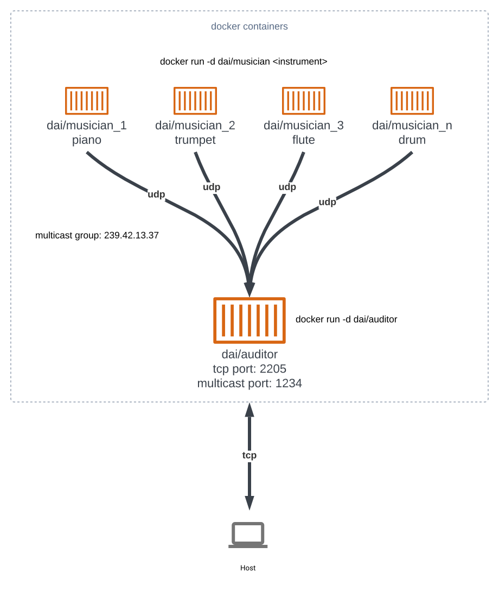

# DAI-2022-UDP-Orchestra

## Admin

- **You can work in groups of 2 students**.
- It is up to you if you want to fork this repo, or if you prefer to work in a private repo. However, you have to **use exactly the same directory structure for the validation procedure to work**.
- We expect that you will have more issues and questions than with other labs (because we have a left some questions open on purpose). Please ask your questions on Teams, so that everyone in the class can benefit from the discussion.
- ⚠️ You will have to send your GitHub URL, answer the questions and send the output log of the `validate.sh` script, which prove that your project is working [in this Google Form](https://forms.gle/6SM7cu4cYhNsRvqX8).

## Objectives

This lab has 4 objectives:

- The first objective is to **design and implement a simple application protocol on top of UDP**. It will be very similar to the protocol presented during the lecture (where thermometers were publishing temperature events in a multicast group and where a station was listening for these events).

- The second objective is to get familiar with several tools from **the JavaScript ecosystem**. You will implement two simple **Node.js** applications. You will also have to search for and use a couple of **npm modules** (i.e. third-party libraries).

- The third objective is to continue practicing with **Docker**. You will have to create 2 Docker images (they will be very similar to the images presented in class). You will then have to run multiple containers based on these images.

- Last but not least, the fourth objective is to **work with a bit less upfront guidance**, as compared with previous labs. This time, we do not provide a complete webcast to get you started, because we want you to search for information (this is a very important skill that we will increasingly train). Don't worry, we have prepared a fairly detailed list of tasks that will put you on the right track. If you feel a bit overwhelmed at the beginning, make sure to read this document carefully and to find answers to the questions asked in the tables. You will see that the whole thing will become more and more approachable.

## Requirements

In this lab, you will **write 2 small NodeJS applications** and **package them in Docker images**:

- the first app, **Musician**, simulates someone who plays an instrument in an orchestra. When the app is started, it is assigned an instrument (piano, flute, etc.). As long as it is running, every second it will emit a sound (well... simulate the emission of a sound: we are talking about a communication protocol). Of course, the sound depends on the instrument.

- the second app, **Auditor**, simulates someone who listens to the orchestra. This application has two responsibilities. Firstly, it must listen to Musicians and keep track of **active** musicians. A musician is active if it has played a sound during the last 5 seconds. Secondly, it must make this information available to you. Concretely, this means that it should implement a very simple TCP-based protocol.


### Instruments and sounds

The following table gives you the mapping between instruments and sounds. Please **use exactly the same string values** in your code, so that validation procedures can work.

| Instrument | Sound       |
| ---------- | ----------- |
| `piano`    | `ti-ta-ti`  |
| `trumpet`  | `pouet`     |
| `flute`    | `trulu`     |
| `violin`   | `gzi-gzi`   |
| `drum`     | `boum-boum` |

### TCP-based protocol to be implemented by the Auditor application

- The auditor should include a TCP server and accept connection requests on port 2205.
- After accepting a connection request, the auditor must send a JSON payload containing the list of <u>active</u> musicians, with the following format (it can be a single line, without indentation):

```
[
  {
  	"uuid" : "aa7d8cb3-a15f-4f06-a0eb-b8feb6244a60",
  	"instrument" : "piano",
  	"activeSince" : "2016-04-27T05:20:50.731Z"
  },
  {
  	"uuid" : "06dbcbeb-c4c8-49ed-ac2a-cd8716cbf2d3",
  	"instrument" : "flute",
  	"activeSince" : "2016-04-27T05:39:03.211Z"
  }
]
```

### What you should be able to do at the end of the lab

You should be able to start an **Auditor** container with the following command:

```
$ docker run -d -p 2205:2205 dai/auditor
```

You should be able to connect to your **Auditor** container over TCP and see that there is no active musician.

```
$ telnet IP_ADDRESS_THAT_DEPENDS_ON_YOUR_SETUP 2205
[]
```

You should then be able to start a first **Musician** container with the following command:

```
$ docker run -d dai/musician piano
```

After this, you should be able to verify two points. Firstly, if you connect to the TCP interface of your **Auditor** container, you should see that there is now one active musician (you should receive a JSON array with a single element). Secondly, you should be able to use `tcpdump` to monitor the UDP datagrams generated by the **Musician** container.

You should then be able to kill the **Musician** container, wait 5 seconds and connect to the TCP interface of the **Auditor** container. You should see that there is now no active musician (empty array).

You should then be able to start several **Musician** containers with the following commands:

```
$ docker run -d dai/musician piano
$ docker run -d dai/musician flute
$ docker run -d dai/musician flute
$ docker run -d dai/musician drum
```

When you connect to the TCP interface of the **Auditor**, you should receive an array of musicians that corresponds to your commands. You should also use `tcpdump` to monitor the UDP trafic in your system.

# Tasks and questions

Reminder: answer the following questions [here](https://forms.gle/6SM7cu4cYhNsRvqX8).

## Task 1: design the application architecture and protocols

| #        | Topic                                                                                                                                                                                                                                                                                                                                                                                                                                                                                                                                                                                                   |
| -------- |---------------------------------------------------------------------------------------------------------------------------------------------------------------------------------------------------------------------------------------------------------------------------------------------------------------------------------------------------------------------------------------------------------------------------------------------------------------------------------------------------------------------------------------------------------------------------------------------------------|
| Question | How can we represent the system in an **architecture diagram**, which gives information both about the Docker containers, the communication protocols and the commands?                                                                                                                                                                                                                                                                                                                                                                                                                                 |
|          |                                                                                                                                                                                                                                                                                                                                                                                                                                                                                                                                                                 |
| Question | Who is going to **send UDP datagrams** and **when**?                                                                                                                                                                                                                                                                                                                                                                                                                                                                                                                                                    |
|          | Les musiciens aux auditeurs toutes les secondes.                                                                                                                                                                                                                                                                                                                                                                                                                                                                                                                                                        |
| Question | Who is going to **listen for UDP datagrams** and what should happen when a datagram is received?                                                                                                                                                                                                                                                                                                                                                                                                                                                                                                        |
|          | Les auditeurs écoutent et mettent à jour la liste des musiciens actifs et peuvent la partager à l'hôte via une connexion TCP.                                                                                                                                                                                                                                                                                                                                                                                                                                                                           |
| Question | What **payload** should we put in the UDP datagrams?                                                                                                                                                                                                                                                                                                                                                                                                                                                                                                                                                    |
|          | L'uuid du musicien, le son de l'instrument duquel joue le musicien.                                                                                                                                                                                                                                                                                                                                                                                                                                                                                                                                     |
| Question | What **data structures** do we need in the UDP sender and receiver? When will we update these data structures? When will we query these data structures?                                                                                                                                                                                                                                                                                                                                                                                                                                                |
|          | Le musicien stocke son uuid et le son de son instrument. Ces deux informations ne sont jamais mises à jour, elles sont définies à la création du musicien. Elles sont utilisées par le musicien lors de l'envoie aux auditeurs. Concernant les auditeurs, ils maintiennent une liste de HashMap contenant pour chacun d'entre eux l'uuid d'un musicien, l'instrument joué et finalement la dernière fois qu'il a émit un son. Il met à jour cette liste lorsqu'il reçoit un datagramme UDP de la part d'un des musiciens ou toutes les 5 secondes dans le cas où des musiciens ne seraient plus actifs. |
 
## Task 2: implement a "musician" Node.js application

| #        | Topic                                                                                                                                                                                                                                                                                                                                                                                       |
| -------- |---------------------------------------------------------------------------------------------------------------------------------------------------------------------------------------------------------------------------------------------------------------------------------------------------------------------------------------------------------------------------------------------|
| Question | In a JavaScript program, if we have an object, how can we **serialize it in JSON**?                                                                                                                                                                                                                                                                                                         |
|          | JSON.stringify()                                                                                                                                                                                                                                                                                                                                                                            |
| Question | What is **npm**?                                                                                                                                                                                                                                                                                                                                                                            |
|          | C'est une gestionnaire de paquets pour NodeJS.                                                                                                                                                                                                                                                                                                                                              |
| Question | What is the `npm install` command and what is the purpose of the `--save` flag?                                                                                                                                                                                                                                                                                                             |
|          | La commande permet d'installer un paquet en particulier par exemple: `npm install dockerode` ou bien installer toutes les dépendances fournie dans le dossier `package.json`dans le répertoire courant si on ne précise pas de paquet en particulier. Le flag save permet de sauvegarder la dépendances dans le fichier `packages.json`. C'est le comportement par défaut depuis npm 5.0.0. |
| Question | How can we use the `https://www.npmjs.com/` web site?                                                                                                                                                                                                                                                                                                                                       |
|          | Ce site permet de répertorier tous les packages npm, on peut y voir leur version, leur utilisation, etc... On peut le résumer comme étant un wiki pour chaque package.                                                                                                                                                                                                                      |
| Question | In JavaScript, how can we **generate a UUID** compliant with RFC4122?                                                                                                                                                                                                                                                                                                                       |
|          | On peut utiliser le module npm `uuid` qui fournit des méthodes pour créer des uuids respectant la RFC4122 : `import { v4 as uuidv4 } from 'uuid'; uuidv4();`                                                                                                                                                                                                                                |
| Question | In Node.js, how can we execute a function on a **periodic** basis?                                                                                                                                                                                                                                                                                                                          |
|          | On utilise setInterval(). Ex : setInterval(<fonction>, <tempsEnMs>);.                                                                                                                                                                                                                                                                                                                      |
| Question | In Node.js, how can we **emit UDP datagrams**?                                                                                                                                                                                                                                                                                                                                              |
|          | Il faut créer un socket udp en utilisant le module `udp4` et appeler la méthode `send` sur ce socket : `const dgram = require('dgram'); const socket = dgram.createSocket('udp4'); socket.send(msg[, offset, length][, port][, address][, callback]);`                                                                                                                                      |
| Question | In Node.js, how can we **access the command line arguments**?                                                                                                                                                                                                                                                                                                                               |
|          | On utilise `process.argv` pour accéder aux arguments de ligne de commande.                                                                                                                                                                                                                                                                                                                  |

## Task 3: package the "musician" app in a Docker image

| #        | Topic                                                                                                                                                                    |
| -------- |--------------------------------------------------------------------------------------------------------------------------------------------------------------------------|
| Question | How can we use the `ENTRYPOINT` statement in our Dockerfile?                                                                                                             |
|          | `ENTRYPOINT` est utilisé pour passer des paramètres aux containers lors de son exécution (`docker run`).                                                                 |
| Question | How can we check that our running containers are effectively sending UDP datagrams?                                                                                      |
|          | On utilise tcpdump pour vérifier les datagrammes UDP générés par les musiciens. La commande a utilisée est : `tcpdump -i eth0 -s0 -vv host <IP_OF_THE_MULTICAST_GROUP>`. |

## Task 4: implement an "auditor" Node.js application

| #        | Topic                                                                                                                                                                                                                                                                                                                                                       |
| -------- |-------------------------------------------------------------------------------------------------------------------------------------------------------------------------------------------------------------------------------------------------------------------------------------------------------------------------------------------------------------|
| Question | With Node.js, how can we listen for UDP datagrams in a multicast group?                                                                                                                                                                                                                                                                                     |
|          | `client.addMembership('<IP_OF_THE_MULTICAST_GROUP>)`                                                                                                                                                                                                                                                                                                        |
| Question | How can we use the `Map` built-in object introduced in ECMAScript 6 to implement a **dictionary**?                                                                                                                                                                                                                                                          |
|          | Key = uuid and value = musician  (TO CHECK)                                                                                                                                                                                                                                                                                                                 |
| Question | When and how do we **get rid of inactive players**?                                                                                                                                                                                                                                                                                                         |
|          | Lors d'une connexion en TCP à l'interface de l'auditeur, on vérifie s'il existe des musiciens dont le dernier envoie de son est antérieur aux 5 dernières secondes et si c'est le cas, ils sont supprimés. Dans tous les cas, toutes les 5 secondes la liste des musiciens est mise à jour avec ceux étant actifs.                                          |
| Question | How do I implement a **simple TCP server** in Node.js?                                                                                                                                                                                                                                                                                                      |
|          | On doit utiliser le module `net` et utiliser `const server = net.createServer()`. On s'abonne à l'événement ? `connection` dans lequel on passe une fonction de callback qui est appelée quand une connexion est établie. Il suffit d'utiliser la méthode `server.listen(<PORT>)` pour définir sur quel port le serveur TCP écoutera l'arrivée des clients. |

## Task 5: package the "auditor" app in a Docker image

| #        | Topic                                                                       |
| -------- |-----------------------------------------------------------------------------|
| Question | Send us the log file of the validation script to show that everything is ok |
|          | _Enter your response here..._                                               |

## Constraints

Please be careful to adhere to the specifications in this document, and in particular

- the Docker image names
- the names of instruments and their sounds
- the TCP PORT number

Also, we have prepared two directories, where you should place your two `Dockerfile` with their dependent files.

### Validation

Have a look at the `validate.sh` script located in the top-level directory. This script automates part of the validation process for your implementation (it will gradually be expanded with additional operations and assertions). As soon as you start creating your Docker images (i.e. creating your Dockerfiles), you should **try to run it** to see if your implementation is correct. When you submit your project in the [Google Form](https://forms.gle/6SM7cu4cYhNsRvqX8), the script will be used for grading, together with other criteria.
